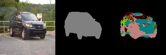
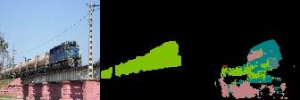

# Tensorflow_FCN (UNet)

## Results (VOC2007 Test meanIU : 86%)

### iter = 1000 (RGB image, GT image, Prediction image)

### iter = 50000 (RGB image, GT image, Prediction image)

## Requirements
- Tensorflow 1.13.1
- OpenCV 4.0.0
- Numpy 1.16.4
